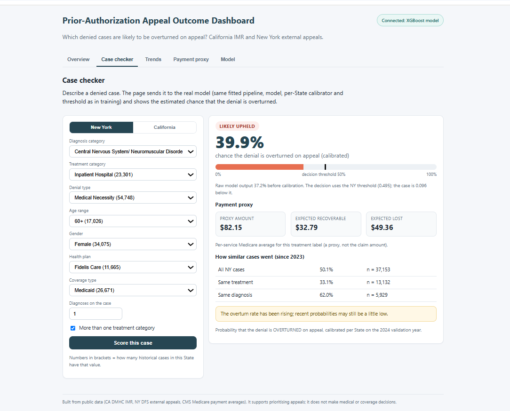
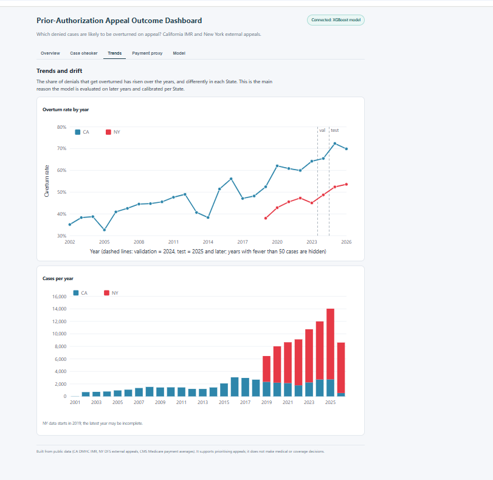
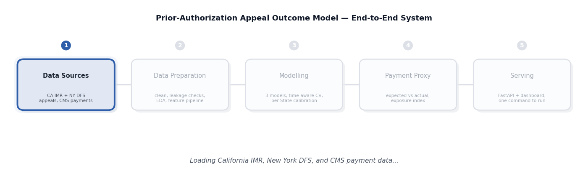
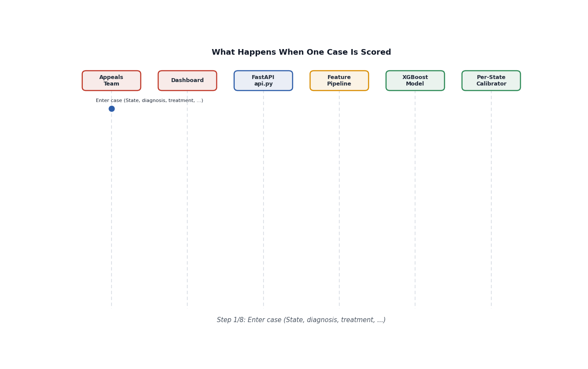

# Prior-Authorization Appeal Outcome Model

A machine-learning system that estimates the probability that a **denied** prior-authorization case will be
**overturned** on appeal, so that appeal teams can put their effort where it is most likely to pay off.
It is trained on real California and New York appeal decisions, tested on years the model never saw,
and served through a live dashboard.

---

## Screenshots

**Case Checker** -- describe a denied case and get the real model's calibrated chance of it being
overturned, along with a payment-proxy estimate and how similar cases went historically.

**Trends and Drift** -- shows how the overturn rate has changed year over year, differently in each
State, which is why the model is calibrated and evaluated separately per State.

---

## Overview

This project answers one question: *"This denial went to appeal. How likely is it to be overturned?"* It
is built on 103,680 real appeal decisions -- California (IMR) from 2001-2026 and New York (external
appeals) from 2019-2026 -- combined with CMS payment averages. A calibrated probability is produced for
each case, along with a per-State decision and a payment-proxy exposure figure, served through a live
dashboard that anyone on the appeals or billing team can use.

---

## Aim

- Estimate the probability that a denied case will be overturned on appeal
- Give appeal and billing teams a clear "likely overturned" / "likely upheld" decision per case
- Show how similar past cases went, by State, treatment, and diagnosis
- Express the money at stake through a clearly labeled payment-proxy estimate
- Present everything through a simple, live, interactive dashboard

---

## Benefits

- **Better prioritization** -- teams can put their limited appeal effort where it is most likely to pay off
- **State-aware accuracy** -- California and New York are evaluated and calibrated separately, since their
  overturn patterns differ
- **Transparent probabilities** -- a "60% chance" shown on screen really does mean about 60%, not an
  inflated or misleading number
- **Historical context** -- every case comes with how similar past cases (same State, treatment, or
  diagnosis) actually turned out
- **Clear money view** -- a labeled payment-proxy estimate, never presented as an actual claim amount
- **One live dashboard** -- no spreadsheets or manual lookups; billing and appeals staff get an answer in
  seconds

---

## Key Features

- Case-level probability that a denial is overturned, calibrated per State
- Live **Case Checker** -- score any real case and see the decision, payment proxy, and historical context
- **Trends and Drift** view -- how overturn rates are changing year over year, per State
- Payment proxy with expected recoverable vs. expected lost amounts
- Simple, one-command dashboard -- every number shown comes from the real model, not a static demo

---

## Architecture

### End-to-end system

### What happens when a case is scored

